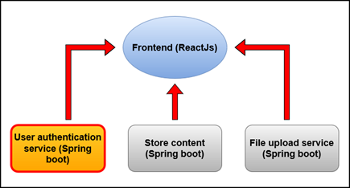

# CTSE - Assignment 3 - Microservices - CTSE-Assignment-User-Management

## Final Overview Diagram 

## About 

This project is a mocroservice implmented from Spring boot. This is done as a group Project. In the user authentication service it is responsible to track all the user details and the profile details that registered in the application. Then the microservice is dockerized and push into the dockerhub. Then a Kubernetes clsuter is created in Azure and deploy the dockerized the micorservice there. And also a CICD pipeline is created in github action files also

## Individual Overview Diagram

## Docker Image

